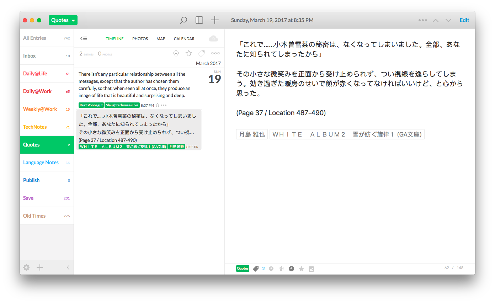

# k2d: Import Kindle Highlights to Day One 2.

This little commandline tool is here to help you importing highlights from Kindle to [Day One 2](http://dayoneapp.com/). 

For each highligh, k2d will creat an entry on Day One 2, the date will be the timestamp you highlighted the quote, and both the book title and author will be saved to the entry as tags.

**Noted**! In order to avoid re-importing the same highlight into Day One and creating duplicated entries, the `My Clippings.txt` file in Kindle will be moved to `~/Document/k2d` directory. `My Clippings.txt` is just a log file and removing it will not interfere with the highlights in your `.azw` or `.mobi` files.

## Prerequisites

* Python 3 (it's recommended to install [anacomda-python3](https://www.continuum.io/downloads))
* Day One 2

## Installation

	pip install k2d

## Usage

First, install Day One 2 CLI tool:

	sudo /Applications/Day\ One.app/Contents/Resources/install_cli.sh

Then, plug your Kindle to your Mac via USB (Sorry, I don't think there's a way to get rid of the cable yet).

In Day One 2, create a new Journal for your Kindle highlights or just use any existing Jounrals you like, then simply enter:

	k2d [name of the Jounral]

in your terminal. For example, importing highlights to a Jounral called `Quotes`:

	k2d Quotes

## Screenshots

