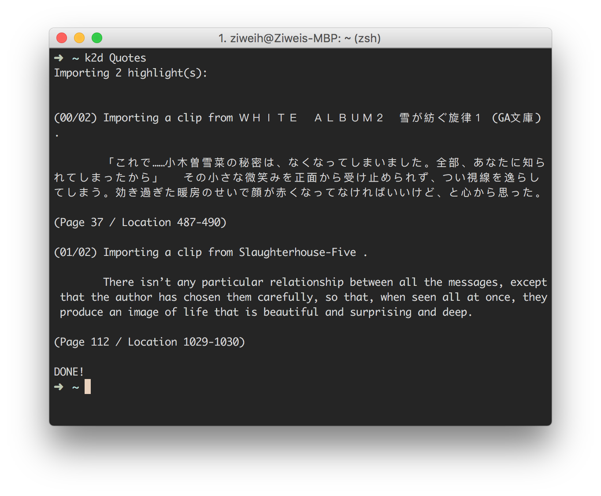

# k2d: Import Kindle Highlights to Day One 2.

## Prerequisites

* Python 3
* Dayone 2

## Installation

	pip install k2d

## Usage

First you need to install Dayone 2 CLI tool

	sudo /Applications/Day\ One.app/Contents/Resources/install_cli.sh

In Dayone 2, create a new Journal for your Kindle highlights or just use any existing Jounrals you like, then simply enter:

	k2d [name of the Jounral]

For example, importing highlights to a Jounral called `Quotes`:

	k2d Quotes

